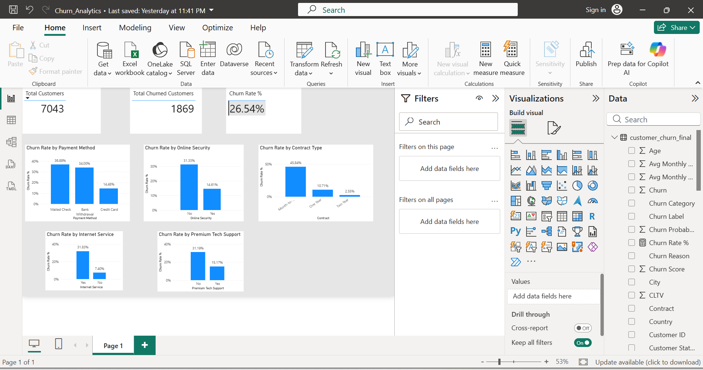
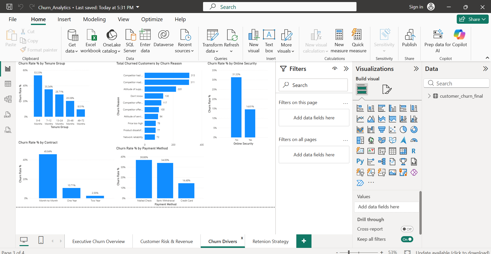
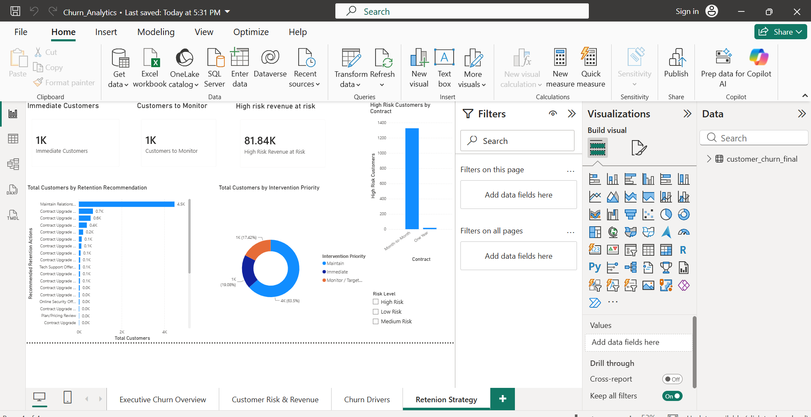

# Customer Churn Prediction & Retention Analytics

## 📌 Project Overview

An end-to-end customer churn analytics project that uses machine learning
and Power BI to identify customers at risk of churn, estimate revenue at
risk, and recommend targeted retention strategies.

## 🎯 Business Problem

Customer churn can lead to significant revenue loss. The goal of this
project is to identify customers likely to churn and translate model
predictions into actionable retention strategies.

## 🛠️ Technologies Used

- Python
- Pandas
- NumPy
- Scikit-learn
- Matplotlib
- Seaborn
- Power BI
- DAX
- Git/GitHub

## 🔄 Project Workflow

1. Data Understanding
2. Exploratory Data Analysis
3. Data Preprocessing
4. Feature Engineering
5. Model Training
6. Model Evaluation
7. Churn Probability Prediction
8. Customer Risk Segmentation
9. Revenue-at-Risk Analysis
10. Retention Strategy
11. Power BI Dashboard

## 🤖 Machine Learning

### Logistic Regression

- Accuracy: 85.52%
- Precision: 75.45%
- Recall: 67.38%
- F1 Score: 71.19%
- ROC-AUC: 91.00%

### Random Forest

- Accuracy: 82.82%
- Precision: 66.67%
- Recall: 70.59%
- F1 Score: 68.57%
- ROC-AUC: 89.94%

Logistic Regression was selected as the final model based on overall
performance and interpretability.

## 🎯 Threshold Optimization

The classification threshold was reduced from 0.50 to 0.30 to improve
churn detection and prioritize recall for customer retention.

At a threshold of 0.30:

- Precision: 61.82%
- Recall: 85.29%
- F1 Score: 71.69%

## 📊 Key Findings

- Month-to-month customers show substantially higher churn.
- Early-tenure customers are a major churn-risk segment.
- Customers without online security show higher churn.
- Customers without premium tech support show higher churn.
- Payment method and contract type are important churn indicators.
- High-risk customers contribute disproportionately to expected revenue at risk.

## 💰 Revenue at Risk

The model estimates approximately ₹138.5K in expected monthly revenue at risk
across the customer base.

## 💡 Retention Strategy

Recommended interventions include:

- Contract upgrade offers
- Early-tenure intervention
- Technical support offers
- Online security offers
- Pricing/plan reviews
- Targeted engagement campaigns

## 📈 Power BI Dashboard

The dashboard contains four pages:

1. Executive Churn Overview
2. Customer Risk & Revenue
3. Churn Drivers
4. Retention Strategy

## 📂 Project Structure

```text
Customer_churn_analytics/
├── Python scripts
├── customer_churn_final.csv
├── Customer_Churn_Analytics.pbix
├── README.md
└── .gitignore


---

## 📊 Dashboard Preview

The Power BI dashboard consists of four interactive pages covering executive insights, customer risk, churn drivers, and retention strategy.

### Executive Churn Overview



### Customer Risk & Revenue


### Churn Drivers



### Retention Strategy




